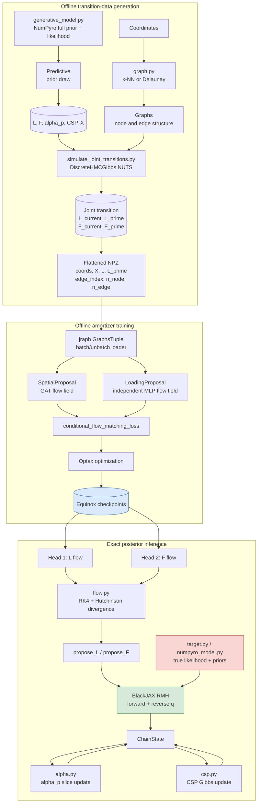

# Amortized Neural MCMC

JAX + Equinox proposal modules with BlackJAX RMH and NumPyro model definitions for exact Metropolis-Hastings updates of spatial factors `L` and gene loadings `F`. The networks only parameterize proposal densities; `log_pi_L` remains independent of proposal parameters.

## Architecture

The project has two workflows. The offline workflow creates joint transition
pairs and trains both amortizer heads. The inference workflow loads the trained
heads, proposes updates, and applies the exact target-density correction.



### Module responsibilities

| Module | Responsibility |
| --- | --- |
| `graph.py` | Builds spatial spot graphs and represents directed edges. |
| `generative_model.py` | Defines the NumPyro prior, CSP hierarchy, MRF prior, patient effects, and Poisson likelihood. |
| `simulate_joint_transitions.py` | Uses `Predictive` for prior states and `DiscreteHMCGibbs(NUTS(...))` for joint `(L,F)` reference transitions. |
| `models.py` | Defines the independent GAT spatial flow and MLP loading flow. |
| `flow.py` | Integrates flow fields and evaluates densities with the divergence correction. |
| `train_amortizer.py` | Loads flattened variable-size graphs and trains both heads with CFM. |
| `sampler.py` | Connects proposals to explicit MH and BlackJAX RMH updates. |
| `target.py` / `numpyro_model.py` | Evaluate the true target, independently of amortizer parameters. |
| `alpha.py` | Updates patient effects outside the neural proposal. |
| `csp.py` | Updates CSP allocation and shrinkage variables outside the neural proposal. |
| `diagnostics.py` / `mixing.py` | Coverage, boundary acceptance, ESS, and MH-versus-Gibbs diagnostics. |

## Install

```bash
conda env create -f environment.yml
conda activate genepathway
```

## Scope

- `build_graph(..., method='knn'|'delaunay')` constructs the non-grid spot graph.
- `SpatialProposal` is a fixed-`H` graph-attention conditional flow field.
- `LoadingProposal` is an independent MLP conditional flow field trained with the same CFM objective as the spatial head.
- `propose_L` integrates the flow and evaluates both directions with RK4 plus a Hutchinson divergence estimate.
- `propose_F` returns bidirectional densities from the independent MLP flow head.
- `conditional_flow_matching_loss` trains the spatial field on paired Markov transitions.
- `sample_csp_prior` and `gibbs_step_csp` handle the fixed-truncation CSP outside the network.
- `compare_mixing` produces matched MH/Gibbs traces and ESS diagnostics on a synthetic slide.
- `mh_step` evaluates the true target in both states.
- `blackjax_mh_step` runs the asymmetric amortized proposal through BlackJAX's RMH kernel.
- `spatial_model` and `numpyro_log_pi_L` expose the L target through NumPyro.
- `gibbs_step_alpha` updates `alpha` without using either network. The Poisson-log-Gaussian conditional is not conjugate, so this is an exact slice update rather than a closed-form Gaussian draw.

## Amortizer HPC Training

The amortizer is trained separately from posterior sampling. Prepare an NPZ with
`coordinates`, `X`, `L_current`, `L_prime`, `F_current`, and `F_prime`, where
`coords`, `X`, `L_current`, and `L_prime` are flattened over all spots,
`edge_index` is globally offset, and `n_node`/`n_edge` delimit each graph.
`F_current` and `F_prime` remain `(N, G, H)`. For every example, `L_prime` and `F_prime` must be recorded from
the same alternating joint reference chain, never paired from separate
marginal chains.

Generate the paired data with:

```bash
python scripts/simulate_joint_transitions.py \
	--output transitions.npz --n-examples 10000 --H 8 --warmup 25 --samples 1
```

The simulator now draws each initial state with NumPyro `Predictive` from the
full prior model, including CSP hyperpriors, allocations, loadings, MRF latent
factors, patient effects, and Poisson observations. It then initializes
`DiscreteHMCGibbs(NUTS(full_generative_model))` at that simulated state and
runs a short joint posterior chain. Discrete `z_h` sites are Gibbs-updated
between continuous NUTS updates, so `L_prime` and `F_prime` come from the same
joint transition.

```bash
conda activate genepathway
python scripts/train_amortizer.py \
	--data transitions.npz \
	--output results/amortizer \
	--H 8 --epochs 10000
```

For Slurm:

```bash
DATA=/path/transitions.npz OUTPUT=/path/results/amortizer sbatch scripts/submit_amortizer_slurm.sh
```

This job only optimizes the GAT and MLP conditional flow fields. It does not
run MH, Gibbs, alpha, CSP, or posterior sampling.
